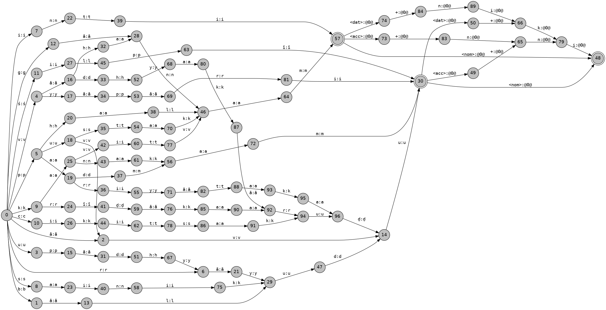

# Telugu Noun Morphotactics with HFST

This project involves creating a finite-state transducer (FST) for basic morphotactics of Telugu nouns using the Helsinki Finite-State Technology (HFST) toolkit. It covers the generation of different grammatical cases (nominative, accusative, dative, and genitive) for a set of Telugu nouns.

## Overview

The `.lexc` file in this repository defines the morphological rules for 20 Telugu nouns. These rules are used to generate various forms of each noun, based on the required grammatical case.

## Nouns Covered

The `.lexc` file includes a set of nouns categorized by gender (masculine, feminine, neuter) and provides rules for generating forms in different grammatical cases. The nouns covered are:

- Masculine Nouns: bāludu (boy), vyāpāri (merchant), sainikudu (soldier), upādhyāyudu (teacher), rāyudu (Raja), krīḍākaaruḍu (athlete), cikitsakuḍu (doctor), śilpī (artist), pariyātakaḍu (tourist), vādhyakāruḍu (musician).
- Feminine Nouns: āvu (cow), puvvu (flower), padmam (lotus), kanakam (gold).
- Neuter Nouns: pustakam (book), inti (house), gānam (song), vāhanam (vehicle), phalam (fruit), kavitvam (poetry).

## File Structure

- `TeluguMorphology_Corrected.lexc`: Contains the lexical rules for the Telugu nouns and their inflections based on gender and case.

## Compiling the Lexicon

To compile the `.lexc` file into an HFST transducer, use the following command:

```bash
hfst-lexc TeluguMorphology_Corrected.lexc -o tel.hfst
```

## Generating The FST

To visualize the FST, you can convert the compiled file into a graphical representation:

```bash
hfst-fst2txt tel.hfst | python3 att2dot.py | dot -Tpng -o tel_lexc.png
```

This command generates a PNG file consisting of the FST diagram for the Telugu noun forms.
The above command would be generating a png file which consists of FST diagram:

