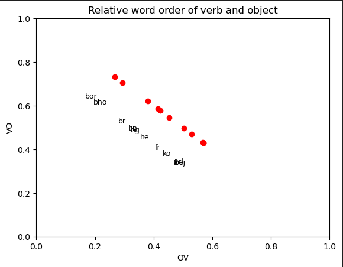

# Relative word order study

## Overview
This script is designed to analyze the syntactic structure of various languages by studying the order of object and verb constituents. It leverages treebanks from the Universal Dependencies (UD) project, focusing on the relative positioning of objects and verbs in sentences. The script processes treebanks in the .conllu format, extracting statistical data about the frequency of Object-Verb (OV) and Verb-Object (VO) orderings.

## Features
- **Treebank Parsing**: Parses .conllu files from the Universal Dependencies project.
- **Syntactic Analysis**: Determines the frequency of OV and VO orderings in different languages.
- **Data Visualization**: Generates a scatter plot showing the relative prevalence of OV and VO orderings across languages.

### Prerequisites
- Python 3.x
- Matplotlib library
- Conllu library
- Conllu Treebanks

### Setup
1. Ensure Python 3.x is installed on your system.
2. Install the required Python libraries

## Usage
1. **Prepare Treebanks**: Ensure that .conllu files are in the working directory. The script expects filenames to start with the language code (e.g., en_english.conllu).
2. **Install Dependencies**: If not already installed, install the required Python libraries using:
3. **Run the Script**: Execute the script in a Python environment. The script automatically scans the current directory for .conllu files and processes them.
4. **View Results**: Upon completion, the script displays a scatter plot visualizing the relative order of objects and verbs in the analyzed languages.

## Output
The script generates a scatter plot with two axes:
- **OV Axis**: Represents the frequency of Object-Verb ordering.
- **VO Axis**: Represents the frequency of Verb-Object ordering.
Each point on the plot corresponds to a language, with annotations indicating the language code.

Below is the plot that I have got:

## Customization
- To analyze a different set of languages, simply replace the .conllu files in the working directory with those of the desired languages.
- Modify the plotting section of the script to customize the appearance of the output graph.

## References
1. https://universaldependencies.org/format.html
2. https://web.stanford.edu/~jurafsky/slp3/old_oct19/15.pdf
